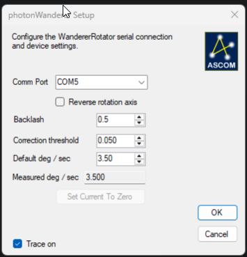

# WandererRotator ASCOM Driver

Lightweight ASCOM `IRotatorV4` driver for WandererRotator hardware — built for imaging rigs where cable safety and accurate angle tracking matter.

## Why This Driver?

| | This driver | WandererEmpire |
|---|---|---|
| **Footprint** | Thin ASCOM COM local-server — no UI process running during imaging | Full standalone application |
| **Cable management** | Built-in: firmware angle is the no-wrap anchor, moves are routed the safe way | None — the user must track cable wrap manually |
| **Auto-correction** | Up to 3 automatic retries when the device stops short of the target | Manual re-slew required |

## Features

- Serial handshake, halt, reverse, backlash
- Virtual mechanical position layer — persisted, editable, never resets the firmware
- Cable-safe move planning: wrap-crossing moves take the long way around instead of crossing 0°/360°
- Configurable completion-correction threshold and default motion-rate estimate
- Learned motion rate displayed in the setup dialog

## Setup Dialog



| Setting | Persisted | Notes |
|---|---|---|
| COM port | yes | |
| Trace logging | yes | |
| Reverse | yes | applied immediately if connected |
| Backlash | yes | applied immediately if connected |
| Virtual mechanical position | yes | driver-side only — no firmware reset |
| Correction threshold | yes | |
| Default motion rate (°/s) | yes | also resets the internal learned rate |
| Measured motion rate (°/s) | — | read-only |

## Motion Model

The firmware reports its mechanical angle but accepts only signed left/right rotation commands. The driver bridges the gap:

1. **Dual-position tracking** — firmware angle (cable anchor) and virtual mechanical position (persisted, reported) are maintained independently.
2. **Cable-safe routing** — every move is planned so the firmware angle never crosses its own 0°/360° boundary. If the shortest path would wrap, the driver takes the longer safe route.
3. **Live estimation** — during a move the driver continuously updates `Position` and `MechanicalPosition` based on the learned motion rate, so clients see smooth angle changes in real time.
4. **Completion & correction** — when the device sends its move-complete frame the driver updates the firmware anchor, advances the virtual layer by the observed delta, and persists the result. If the residual error exceeds the threshold, it issues up to three correction moves.
5. **Sync without reset** — `Sync()` adjusts the offset between the virtual mechanical position and the ASCOM logical position; it never touches the firmware angle.

## Registration

Register once from an elevated prompt:

```powershell
cd .\WandererRotator\bin\Debug
.\ASCOM.photonWanderer.exe /regserver
```

Unregister: `.\ASCOM.photonWanderer.exe /unregserver` — do not use `RegAsm`.

## Logging

ASCOM trace logs go to the standard logs folder under Documents:

- `ASCOM.photonWanderer.Hardware.*` — protocol framing, moves, corrections
- `ASCOM.photonWanderer.Driver.*` — ASCOM property/method calls
- `ASCOM.photonWanderer.LocalServer.*` — COM registration lifecycle

## Known Limitations

- No firmware absolute-move command; all moves are translated to signed relative amounts
- The driver never sends a firmware zeroing command — edit the virtual mechanical position instead
- In-flight angles are estimated until the completion frame arrives
- Wrap-crossing moves take the longer route (by design)
- Handshake parsing is tolerant of device-model name variants not fully documented by the vendor

## Development Notes

- ASCOM COM local server, not Alpaca — target platform `x86`
- Main implementation: [WandererRotator/RotatorDriver/RotatorHardware.cs](WandererRotator/RotatorDriver/RotatorHardware.cs)


